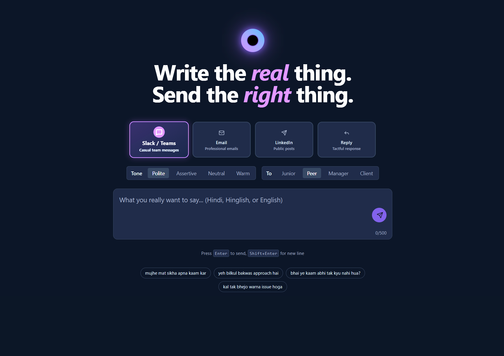
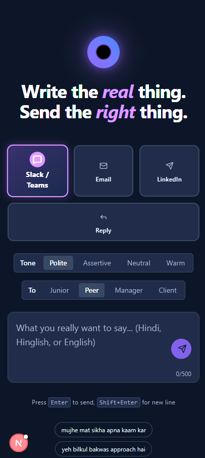
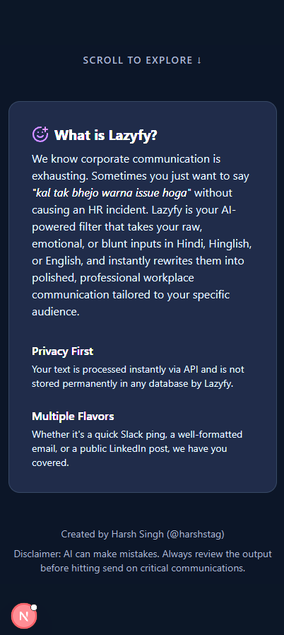

# 😴 Lazyfy 

**Write the *real* thing. Send the *right* thing.**

  
  
  
  
  

---

## 🧐 What is Lazyfy?

We know corporate communication is exhausting. Sometimes you just want to say _"kal tak bhejo warna issue hoga"_ without causing an HR incident. 

**Lazyfy** is your AI-powered filter that takes your raw, emotional, or blunt inputs in **Hindi, Hinglish, or English**, and instantly rewrites them into polished, professional workplace communication tailored to your specific audience. 

  
  
  

## ✨ Features

- 🎯 **Contextual Variations:** Generate tailored messages for Slack/Teams, Email, LinkedIn, or quick Replies.
- 🎭 **Adjustable Tone:** Shift your message's tone between Polite, Assertive, Neutral, or Warm.
- 👥 **Audience Targeting:** Keep the right distance by selecting your audience context—Junior, Peer, Manager, or Client.
- 🔒 **Privacy First:** Your text is processed instantly via the Google Gemini API and is **never** stored permanently in any database.
- 💅 **Modern & Fluid UI:** Beautiful dark mode aesthetics powered by Tailwind CSS and smooth micro-animations using Framer Motion.

## 🛠 Tech Stack

| Category | Technologies |
| -------- | ------------ |
| **Frontend** | Next.js (App Router), React 19, Tailwind CSS v4, Framer Motion |
| **Icons** | Lucide React |
| **AI Integration** | `@google/genai` (Gemini 2.5 Flash) |
| **Hosting** | Vercel (Edge-ready) |

## 🚀 Getting Started

To run this project locally, follow these steps:

1. **Clone the repository and install dependencies:**
   \`\`\`bash
   npm install
   \`\`\`

2. **Set up environment variables:**
   Rename \`.env.example\` to \`.env.local\` (or create a new \`.env.local\` file) and add your Gemini API Key.
   \`\`\`env
   GEMINI_API_KEY=your_gemini_api_key_here
   \`\`\`

3. **Run the local development server:**
   \`\`\`bash
   npm run dev
   \`\`\`
   Open [http://localhost:3000](http://localhost:3000) in your browser to see the application.

## ⚡ Deployment

Lazyfy is fully optimized for Vercel. 

1. Push your code to GitHub.
2. Import the project in your Vercel Dashboard.
3. Add the `GEMINI_API_KEY` to the Environment Variables settings in Vercel.
4. Deploy in seconds!

## 🤝 Credits

Created by **Harsh Singh** ([@harshstag](https://github.com/harshstag)).

---
> **Disclaimer:** AI can make mistakes. Always review the output before hitting send on critical communications.
